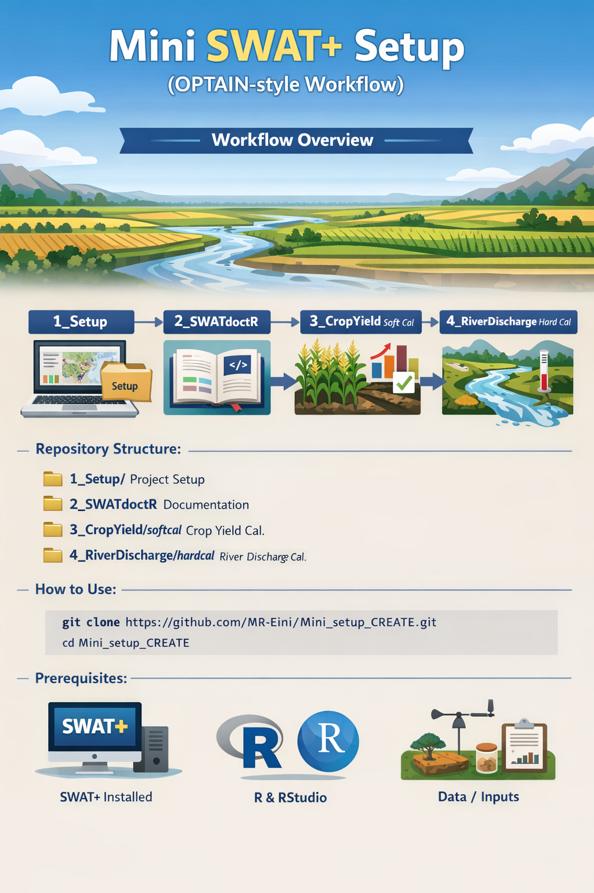

# Mini SWAT+ Setup (OPTAIN-style workflow)



This repository is organized as a **minimal, step-by-step workflow** for setting up a SWAT+ project and running a calibration workflow in distinct stages. citeturn6view0

## Repository structure

- **`1_Setup/`** — project setup materials (inputs/layout/checks) and the workflow overview figure. citeturn6view0turn7view0  
- **`2_SWATdoctR/`** — documentation-related materials (for SWAT project documentation using SWATdoctR). citeturn6view0  
- **`3_CropYield/softcal/`** — crop-yield **soft calibration** workflow. citeturn6view0  
- **`4_RiverDischarge/hardcal/`** — river-discharge **hard calibration** workflow. citeturn6view0  

## How to use

Clone the repository:

```bash
git clone https://github.com/MR-Eini/Mini_setup_CREATE.git
cd Mini_setup_CREATE
```

Recommended workflow order (follow folders in ascending order):

1. Start with **`1_Setup/`** and complete the setup steps/files provided there.
2. Generate or update documentation via **`2_SWATdoctR/`** (if you use SWATdoctR in your workflow).
3. Run crop-yield calibration steps in **`3_CropYield/softcal/`**.
4. Run discharge calibration steps in **`4_RiverDischarge/hardcal/`**.

## Prerequisites (typical)

This repository is meant to sit on top of a standard SWAT+ workflow. Depending on your local setup, you will typically need:

- A working **SWAT+** installation and a runnable SWAT+ project directory.
- **R** + RStudio (for scripts/tools, if the workflow is R-based).
- Any project-specific datasets required by the scripts (e.g., weather, soils, management, observations).

If a step fails due to missing data or paths, check the corresponding folder for configuration files and path settings.

## Conventions

- Folder names are numbered to reflect the recommended execution order.
- Keep your run outputs (logs, calibration outputs, figures) under the corresponding step folder, so the workflow remains reproducible.

## Citation

If you use this workflow in a report/paper, you can cite the repository:

```text
MR-Eini. Mini_setup_CREATE. GitHub repository. https://github.com/MR-Eini/Mini_setup_CREATE
```

(Replace with a DOI if you later archive a release on Zenodo.)

## License

No license file is included in the repository root at the moment. If you intend others to reuse the code, consider adding a license (e.g., MIT, GPL-3.0). citeturn6view0
