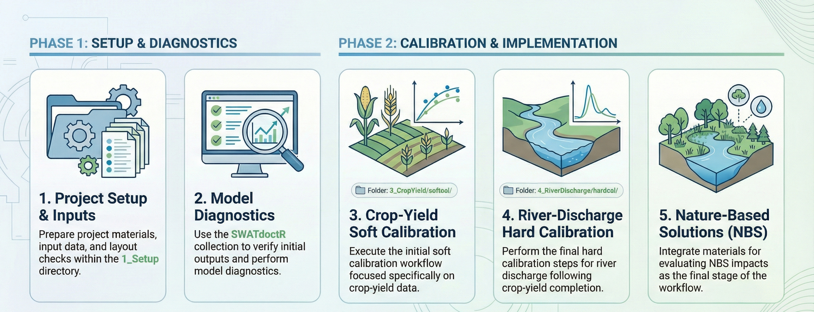

# Mini SWAT+ Setup (OPTAIN-style workflow)


This repository provides a **minimal, step-by-step workflow** for regenerating a SWAT+ project from **pre-processed inputs**, performing essential diagnostics, and (optionally) proceeding to **soft (crop yield)** and **hard (river discharge)** calibration stages.


## Contents

- [Workflow at a glance](#workflow-at-a-glance)
- [Repository structure](#repository-structure)
- [Prerequisites](#prerequisites)
- [Quick start](#quick-start)
- [Step-by-step workflow](#step-by-step-workflow)
  - [1) Setup regeneration (1_Setup)](#1-setup-regeneration-1_setup)
  - [2) Diagnostics (2_swatdoctr)](#2-diagnostics-2_swatdoctr)
  - [3) Crop-yield soft calibration (3_cropyieldsoftcal)](#3-crop-yield-soft-calibration-3_cropyieldsoftcal)
  - [4) River-discharge hard calibration (4_riverdischargehardcal)](#4-river-discharge-hard-calibration-4_riverdischargehardcal)
  - [5) Nature-based solutions (5_nbs)](#5-nature-based-solutions-5_nbs)
- [Inputs and directory conventions](#inputs-and-directory-conventions)
- [Outputs](#outputs)
- [Troubleshooting](#troubleshooting)
- [Acknowledgements / Funding](#acknowledgements--funding)
- [Funding logos](#funding-logos)
- [Citation](#citation)
- [License](#license)

---

## Workflow at a glance

The workflow is organized in numbered folders to support reproducible execution:

1. **Regenerate an uncalibrated SWAT+ setup** from pre-processed GIS layers and tables (SWATbuildR + SWATprepR + SWATfarmR utilities).
2. **Run diagnostics** to verify the model setup and key inputs/outputs.
3. **Soft calibration (crop yield)** to improve crop growth realism.
4. **Hard calibration (river discharge)** to match observed hydrographs.
5. **(Optional) NBS workflows** for nature-based solution assessment.

---

## Repository structure

- **[`1_Setup/`](1_Setup/)** — end-to-end **setup regeneration** workflow (from pre-processed inputs to a runnable SWAT+ setup).
- **[`2_SWATdoctR/`](2_SWATdoctR/)** — model **diagnostics** utilities / routines (SWATdoctR-oriented).
- **[`3_CropYield/softcal/`](3_CropYield/softcal/)** — **crop-yield soft calibration** workflow.
- **[`4_RiverDischarge/hardcal/`](4_RiverDischarge/hardcal/)** — **river-discharge hard calibration** workflow.
- **[`5_NBS/`](5_NBS/)** — (optional) **nature-based solutions** workflows/materials.
- **[`assets/`](assets/)** — figures and logos referenced by this README.

---

## Prerequisites

### Software

- A working **SWAT+ executable** (the model binary you want to run).
- **write.exe** (SWAT+ input writer; used to generate `TxtInOut` from the SQLite database).
- **R** (recommended: R 4.x) and (optionally) **RStudio**.

### R packages (typical)

This repository relies on packages commonly used in OPTAIN-style SWAT+ workflows, including (non-exhaustive):

- `SWATprepR`, `SWATfarmR`, `SWATtunR`, `SWATrunR`, `SWATdoctR`
- Supporting packages such as `sf`, `dplyr`, `tidyverse`, `mapview`, etc.

Example installation snippet (adapt and pin versions as needed):

```r
install.packages("remotes")
install.packages(c("RNetCDF", "tidyverse", "mapview", "sf", "dplyr", "gstat"))

remotes::install_github("biopsichas/SWATtunR")
remotes::install_github("biopsichas/SWATprepR")
remotes::install_github("tkdweber/euptf2")
remotes::install_github("chrisschuerz/SWATfarmR")
remotes::install_github("chrisschuerz/SWATrunR")
remotes::install_github("biopsichas/SWATdoctR")
```


> Note: Some workflows may expect specific SWATfarmR versions. See the `1_Setup/README.md` and the header comments in `1_Setup/setup_workflow.R`.

---

## Quick start

Clone the repository:

```bash
git clone https://github.com/MR-Eini/Mini_setup_CREATE.git
cd Mini_setup_CREATE
```

Run the setup regeneration workflow (typical):

```bash
cd 1_Setup
Rscript setup_workflow.R
```

Then proceed to diagnostics and calibration steps using the numbered folders.

---

## Step-by-step workflow


### 1) Setup regeneration (`1_Setup`)

The `1_Setup/` folder contains an end-to-end workflow to regenerate a complete SWAT+ setup **from pre-processed inputs** to a **runnable** project (and to export a cleaned input-only setup for subsequent calibration/scenarios).

Key files:

- **`1_Setup/setup_workflow.R`** — main workflow driver
- **`1_Setup/settings.R`** — project configuration (paths, years, SWATbuildR and SWATfarmR settings)
- **`1_Setup/functions.R`** — helper functions sourced by `setup_workflow.R`

Important notes:

- **Input data preparation is NOT part of this workflow.** You must provide required pre-processed layers/tables externally.
- The workflow typically writes outputs into a results directory (commonly `Temp_`) and may **delete/recreate** it. Review settings before running.

Recommended run modes:

- **RStudio:** open `1_Setup/`, edit `settings.R`, then `source("setup_workflow.R")`.
- **Command line:** `cd 1_Setup && Rscript setup_workflow.R`.

For full details, see **[`1_Setup/README.md`](1_Setup/README.md)**.

---

### 2) Diagnostics (`2_SWATdoctR`)

The `2_SWATdoctR/` folder is intended for:

- Setup checks (file presence, configuration sanity)
- Output diagnostics (quick checks on simulation outputs)
- Workflow support routines (e.g., report generation)

Run the scripts in this folder after `1_Setup` has produced a runnable setup (e.g., the `TxtInOut` folder and initial SWAT+ run).

---

### 3) Crop-yield soft calibration (`3_CropYield/softcal`)

The `3_CropYield/softcal/` folder is intended for **soft calibration** of crop growth/yields, typically by adjusting plant/crop parameters to better match observed yields or phenology.

Typical inputs:

- Observed yield (or crop performance) data for the calibration period
- The regenerated model setup (from `1_Setup`, ideally the clean setup export)
- Optional management / crop operation updates

Typical outputs:

- Parameter updates / calibration summaries
- Diagnostic plots/tables of yield fit

---

### 4) River-discharge hard calibration (`4_RiverDischarge/hardcal`)

The `4_RiverDischarge/hardcal/` folder is intended for **hard calibration** against observed river discharge, typically involving parameter optimization and goodness-of-fit metrics.

Typical inputs:

- Gauge discharge time series
- A model setup that has passed basic diagnostics
- A defined calibration/validation period (plus warm-up)

Typical outputs:

- Calibrated parameter sets
- Fit metrics (e.g., NSE/KGE/RMSE) and hydrograph comparisons

---

### 5) Nature-based solutions (`5_NBS`)

The `5_NBS/` folder is intended for NBS-related workflows and scenario assessment materials. Contents may include scripts, templates, or analyses specific to nature-based solutions within the CREATE/OPTAIN-style context.

---

## Inputs and directory conventions

The setup workflow expects **pre-processed** GIS layers and tabular inputs. A typical structure referenced in `1_Setup` looks like this (names are illustrative; configure paths in `1_Setup/settings.R`):

```text
1_Setup/
├── setup_workflow.R
├── settings.R
├── functions.R
├── Data/
│   ├── for_buildr/
│   │   ├── DEM1.tif
│   │   ├── soil1.tif
│   │   ├── Soil_SWAT_cod.csv
│   │   ├── usersoil_lrew.csv
│   │   ├── land1.shp (+ sidecars)
│   │   ├── river1.shp (+ sidecars)
│   │   └── basin1.shp (+ sidecars)
│   ├── for_prepr/
│   │   └── met_int.rds
│   └── for_farmr_input/
│       ├── crops1.shp (+ sidecars)
│       ├── mgt_crops.csv
│       └── mgt_generic.csv
└── Libraries/
    ├── buildr_script/
    ├── farmR_input/
    ├── files_to_overwrite_at_the_end/
    ├── write.exe
    └── (SWAT+ executable)
```

Adapt the paths and names in `1_Setup/settings.R` to match your local environment and dataset.

---

## Outputs

Depending on configuration, the workflow typically produces:

- A regenerated SWAT+ project (SQLite + `TxtInOut`)
- A backup of the generated SQLite database (zipped)
- Exported SWATfarmR input CSVs (management schedules)
- A **clean input-only setup export** (suitable for archiving, calibration, or scenario runs)

See `1_Setup/README.md` for the expected output paths and export logic.

---

## Troubleshooting

Common issues are documented in **[`1_Setup/README.md`](1_Setup/README.md)**. Typical examples include:

- Multiple or missing `.sqlite` databases in the results directory.
- `write.exe` failures (SQLite configuration / compatibility).
- SWATfarmR version mismatches for management scheduling.
- Reservoir connectivity issues requiring consistency fixes.

---

## Acknowledgements / Funding

This work was carried out within the **CREATE** project (**C**ross-**RE**alm modelling and assessment of **A**quatic ecosystem services – **T**owards a science-based design of nature-based solutions to tackle **E**utrophication):  
https://sisu.ut.ee/create-project/

**Funding programme description:** The project CREATE has received funding from the Estonian Research Council, Research Council of Finland, Latvian Council of Science, Research Council of Lithuania, National Centre of Research and Development in Poland, and the European Union’s Horizon Europe Programme under the **2023 Joint Transnational Call** of the European Partnership **Water4All** (Grant Agreement No. **101060874**).


---

## Funding logos

<p align="center">
  
</p>

<p align="center">
  
</p>

---

## Citation

If you use this workflow in a report/paper, you can cite the repository:


Mohammad Reza Eini, Department of Hydrology, Meteorology, and Water Management, 
Institute of Environmental Engineering, Warsaw University of Life Sciences, Warsaw, Poland
 Mini_setup_CREATE. GitHub repository. https://github.com/MR-Eini/Mini_setup_CREATE

<div id="refs" class="references csl-bib-body hanging-indent"
entry-spacing="0">

<div id="ref-optain2022" class="csl-entry">

Christoph, Schürz, Čerkasova Natalja, Farkas Csilla, Nemes Attila,
Plunge Svajunas, Strauch Michael, Szabó Brigitta, and Piniewski Mikołaj.
2022. “<span class="nocase">SWAT+ modeling protocol for the assessment
of water and nutrient retention measures in small agricultural
catchments</span>.” Zenodo. <https://doi.org/10.5281/zenodo.7463395>.

</div>

<div id="ref-piniewski2026" class="csl-entry">

Piniewski, Mikołaj, Natalja Čerkasova, Svajunas Plunge, Michael Strauch, 
Christoph Schürz, Péter Braun, Enrico Antonio Chiaradia, Joana Eichenberger, 
Mohammad Reza Eini, Csilla Farkas, Marie Anne Eurie Forio, Peter Goethals, 
Piroska Kassai, Štěpán Marval, Diego G Panique-Casso, Lorenzo Sanguanini, 
Moritz Shore, Brigitta Szabó, Petr Slavík, Felix Witing.
2025. “<span class="nocase">Enhanced crop calibration for SWAT+: 
evaluating water, sediment and nutrient impacts across ten European catchments
</span>.” *Environmental Modelling &Software* 2025: 106794. 
<https://doi.org/10.1016/j.envsoft.2025.106794>.

</div>

<div id="ref-plunge2024a" class="csl-entry">

Plunge, Svajunas, Christoph Schürz, Natalja Čerkasova, Michael Strauch,
and Mikołaj Piniewski. 2024. “<span class="nocase">SWAT+ model setup
verification tool: SWATdoctR</span>.” *Environmental Modelling &
Software* 171: 105878. <https://doi.org/10.1016/j.envsoft.2023.105878>.

</div>

<div id="ref-plunge2024b" class="csl-entry">

Plunge, Svajunas, Brigitta Szabó, Michael Strauch, Natalja Čerkasova,
Christoph Schürz, and Mikołaj Piniewski. 2024.
“<span class="nocase">SWAT + input data preparation in a scripted
workflow: SWATprepR</span>.” *Environmental Sciences Europe* 36 (1): 53.
<https://doi.org/10.1186/s12302-024-00873-1>.


Related community (OPTAIN): https://zenodo.org/communities/optain-h2020-project/

---

## License

This repository currently indicates: **MIT, GPL-3.0**.

