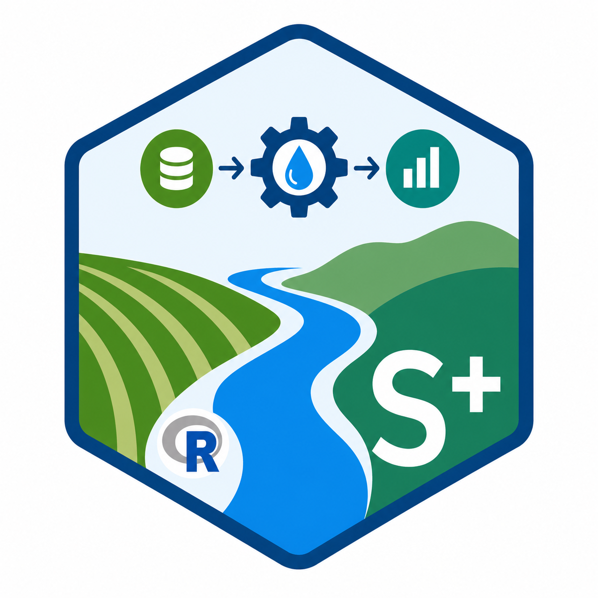
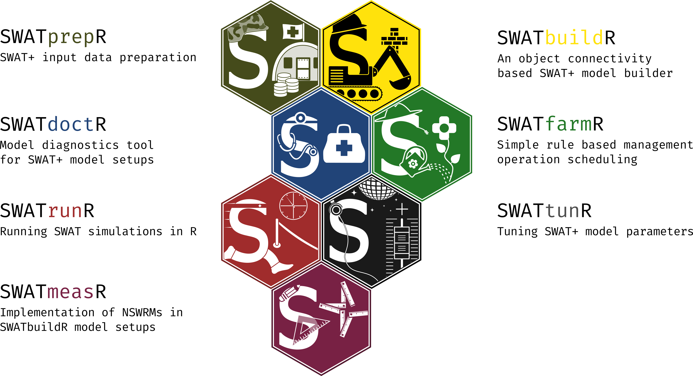
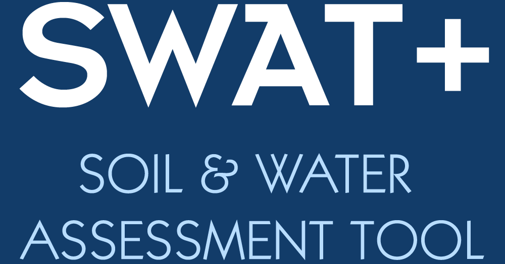

# Mini_setup_CREATE

**SWAT+ setup and scenario preparation toolkit for OPTAIN-style workflows**

`Mini_setup_CREATE` is a structured workflow repository for regenerating a SWAT+ setup from pre-processed inputs, checking the setup with SWATdoctR, performing crop-yield soft calibration, and running river-discharge hard calibration.

[Open repository](https://github.com/MR-Eini/Mini_setup_CREATE){ .md-button .md-button--primary }
[Get started](getting-started.md){ .md-button }

<div class="hero-figure" markdown>






</div>

## Workflow overview

The repository is organized as a staged workflow.

<div class="grid cards" markdown>

-   **1_Setup**

    Regenerates a complete SWAT+ setup from pre-processed GIS, soil, weather, crop, and management inputs.

    [Open page](setup.md)

-   **2_SWATdoctR**

    Verifies an existing clean SWAT+ setup using diagnostic simulations and plots.

    [Open page](swatdoctr.md)

-   **3_CropYield / softcal**

    Performs semi-automatic soft calibration of crop development, crop yield, and water-yield parameters.

    [Open page](crop-yield-softcal.md)

-   **4_RiverDischarge / hardcal**

    Runs sampled SWAT+ simulations and evaluates discharge and water-quality calibration performance.

    [Open page](river-discharge-hardcal.md)

-   **5_NBS**

    Placeholder page for nature-based solution workflows and scenario assessment material.

    [Open page](nbs.md)


</div>

## Project and funding logos

<div class="logo-strip" markdown>

<div class="logo-card logo-card--large" markdown>

</div>

<div class="logo-card logo-card--large" markdown>

</div>

<div class="logo-card logo-card--large" markdown>

</div>

<div class="logo-card logo-card--large" markdown>

</div>

</div>


## Repository structure

```text
Mini_setup_CREATE/
├── 1_Setup/
├── 2_SWATdoctR/
├── 3_CropYield/
│   └── softcal/
├── 4_RiverDischarge/
│   └── hardcal/
├── 5_NBS/
├── Docs/
├── assets/
├── README.md
├── mkdocs.yml              # added for this website
├── site_docs/              # added for this website
└── .github/workflows/
    └── deploy-docs.yml     # added for GitHub Pages deployment
```

!!! note "Documentation scope"
    This website documents the workflow structure and scripts. It does not replace case-study-specific checking of input data, parameter choices, model calibration quality, or SWAT+ output plausibility.

## Recommended use

1. Start with the [Getting started](getting-started.md) page.
2. Prepare the environment and input data.
3. Run the numbered folders in sequence.
4. Use the diagnostic and calibration pages to interpret outputs.
5. Keep all selected parameters, plots, and simulation metadata with the project archive.
